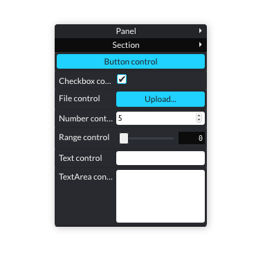

# smartsettings.js@2.0 [WIP]

JS library for creating setting panels.

*Version 2.x.x preview*



## Installation

### Yarn
```
yarn add smartsettings
```

### Npm

```
npm install --save smartsettings
```

## Usage

### Default creation
```javascript
import SmartSettings from 'smartsettings';

const settings = SmartSettings();
const panel = settings.panel();
```

### Creation with parameters
```javascript
import SmartSettings from 'smartsettings';

const settings = SmartSettings();
const panel = settings.panel({
    name: 'My panel',
    top: 40,
    left: 300,
    disabled: true,
    listener: (update) => console.log(update),
});
```

### Control creation

```javascript
const settings = SmartSettings();
const panel = settings.panel();
const button = panel.control(
    'button',
    {
        name: 'Init',
        disabled: true
    },
);
```


------------------
# @1.2.3 deprecated docs
## Docs & demos

[Documentation](https://afternoon2.github.io/smartsettings/)

<p data-height="500" data-theme-id="0" data-slug-hash="08a144fdad89d6a44e956ce96c783873" data-default-tab="js,result" data-user="jakub_antolak" data-embed-version="2" data-pen-title="SmartSettings demo" class="codepen"><a href="https://codepen.io/jakub_antolak/pen/08a144fdad89d6a44e956ce96c783873/">SmartSettings demo</a></p>

<p data-height="500" data-theme-id="dark" data-slug-hash="PeaZKE" data-default-tab="js,result" data-user="jakub_antolak" data-embed-version="2" data-pen-title="css gradient maker 2" class="codepen"><a href="https://codepen.io/jakub_antolak/pen/PeaZKE/">css gradient maker 2</a></p>

## API overview
- Controls:
    - `button(name, callback)`
    - `range(name, items, callback)` - items are min, max, default and step
    - `select(name, items, callback)` - items are strings or numbers with option values
    - `checkbox(name, value, callback)`
    - `color(name, value, callback)`
    - `text(name, value, callback)`
    - `textarea(name, value, callback)`
    - `number(name, items, callback)` - items are initial, step, min and max values. Initial and step values are mandatory
    - `file(name, callback)`
    - **In all cases the `callback` parameter (function executed on each change in the control) is optional**
- Methods:
    - `show(name)` - show settings panel or control (if the name is provided) 
    - `hide(name)` - hide settings panel or control (if the name is provided)
    - `enable(name)` - enable specific control
    - `disable(name)` - disable specific control
    - `open()` - open settings panel
    - `close()` - close settings panel
    - `toggle()` - open/close settings panel
    - `destroy()` - remove current panel from the DOM
    - `remove(name)` - removes specific control from the panel
    - `removeAll()` - removes all controls from the panel
    - `getValue(name)` - returns active value of the specific control
    - `setValue(name, value, [synthetic event])` - sets new active value of the specific control. Set syntheticEvent to true if you want to dispatch an event after change.
    - `getIndex(name)` - returns selected index of the select control
    - `setIndex(name, value, [syntheticEvent])` - set new selected index of the select control. Set syntheticEvent to true if you want to dispatch an event after change.
    - `getActiveValues()` - returns object with active values of all controls (except buttons)
    - `setItems(name, items, [syntheticEvent])` - set new dropdown, range or progressbar control items. Set syntheticEvent to true if you want to dispatch an event after change.
    - `getItems(name)` - get items of the specific dropdown, range or progressbar control
    - `watch(callback)` - watch panel for changes and fire callback on each change (real or artificial - from `setItems` or `setValue`).
    - `loadConfig(config)` - load controls in the settings panel from the given object/JSON string/array of objects (config description below).
    - `getConfig([output])` - returns current configuration. Unless there is an output parameter specified, this method returns an object. But you can set the output to be an 'array' or JSON 'string'

### Config template for `loadConfig` method

Each entry in the config object should contain values specific for the control you want to load + type of the control. So in the `color` example it should be the `name` and `value` strings, 'color' `type` and (optionally) a `callback` function, etc. All types are written with small letters.

```js
const config = {
    button: {
        name: 'Button',
        type: 'button',
        callback: () => { /* some function */ }
    }
}
// or
const configArray = [{
    name: 'Buton',
    type: 'button',
    callback: () => { /* some function */ }
}]
// or
const configJSON = "{ "Btn": { "name": "Button", "type": "button" } }" // etc.
```